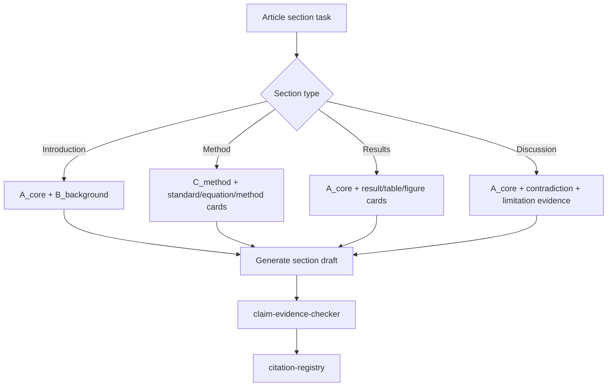

# Section Writing Router

## Purpose

Use this skill when writing article sections from RAG cards. It selects the retrieval strategy by section type and prevents direct unsupported drafting.

## Required State

Read:

```text
<output_root>/workflow_state.json
<output_root>/queries/query_plan.json
<output_root>/retrieval/retrieval_trace.jsonl
```

If `query_plan_status` is not `ready`, call `query-planner`.

If `retrieval_status` is not `ready`, call `hybrid-retrieval`.

## Section Routes

```text
Introduction -> A_core + B_background
Method -> C_method + standard/equation/method cards
Results -> A_core + result/table/figure cards
Discussion -> A_core + contradiction + limitation evidence
Conclusion -> supported key claims only
```

## Routing Table

| Section | Source Classes | Preferred Cards | Main Purpose |
|---|---|---|---|
| Introduction | A_core, B_background | text, citation, result | background, gap, state of the art |
| Method | C_method, A_core | method, equation, standard_clause, table | model, parameter, formula, metric basis |
| Results | A_core, C_method | result, table, figure, data | comparison, mechanism, failure mode |
| Discussion | A_core, B_background, C_method | result, text, table, figure | limitation, contradiction, implication |
| Conclusion | A_core, C_method | result, table, claim map | only supported final claims |

## Draft Output

Write section drafts under:

```text
<output_root>/draft_sections/<section_id>_v1.md
```

Use the next available version number and never overwrite an existing section draft.

Each section draft must include an internal evidence footer:

```text
Evidence used:
- claim_id:
- evidence_id:
- source_id:
- card_id:
```

The footer can be removed from final manuscript prose only after `claim-evidence-checker` has generated claim/evidence maps.

## Workflow

```text
section task
-> determine section type
-> load query_plan entries for section
-> load retrieval_trace entries for section
-> draft section from retrieved evidence only
-> write/update claim_registry and evidence_units when claims are explicit
-> run claim-evidence-checker
-> run citation-registry when visible citations are needed
```

For a non-interactive baseline run of query planning, retrieval, and claim checking, use:

```powershell
python -X utf8 scripts\run_writing_rag_pipeline.py `
  --output-root "<output_root>" `
  --title "<article title>" `
  --sections "Introduction,Method,Results,Discussion"
```

To draft one section from an existing retrieval trace:

```powershell
python -X utf8 skills\section-writing-router\scripts\route_section_writing.py `
  --output-root "<output_root>" `
  --section "Results"
```

## Mermaid Route



## Hard Rules

- Do not write a section directly from memory when relevant RAG cards exist.
- Do not use retrieved evidence outside its section purpose without noting the reason.
- Do not finalize a section until `claim-evidence-checker` has run.
- Do not let `D_internal` appear in visible citations unless explicitly allowed by the user.
- User-visible draft prose defaults to Chinese unless another language is requested.
